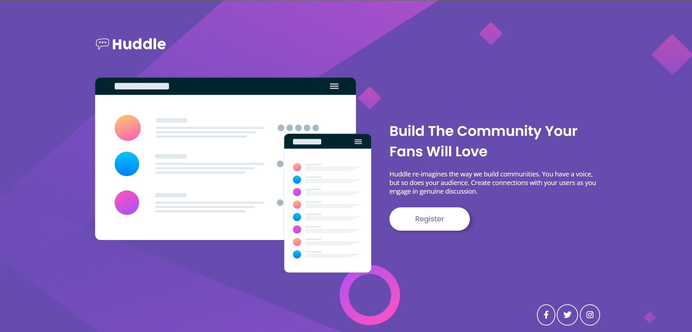
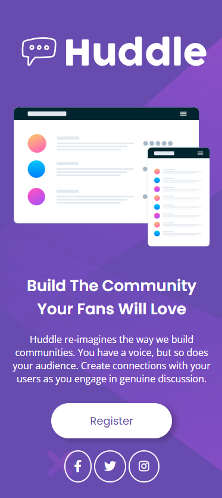

# README - Projeto Huddle Landing Page

### Bem-vindo! 👋
Bem-vindo ao repositório do meu projeto de landing page! Este é um projeto de página de destino (landing page) fictício chamado "Huddle" criado como parte do desafio do Front-end Mentor. O objetivo deste desafio é criar uma página de destino com uma única seção de introdução usando tecnologias web como HTML e CSS.

Neste README, vou compartilhar detalhes sobre o projeto, as tecnologias utilizadas, as dificuldades encontradas e o que aprendi ao longo do caminho.

## Teconologias Utilizadas
Neste projeto, foram utilizadas as seguintes tecnologias:

HTML: Usado para estruturar o conteúdo da página.

CSS: Usado para estilizar a página e torná-la responsiva.

### Utilização do Flex: 
Uma das partes essenciais deste projeto foi a utilização do Flexbox para criar layouts complexos e responsivos. Durante o desenvolvimento, compreendi a importância de selecionar a abordagem adequada para diversas seções da página, assegurando assim que a mesma fosse visualmente atraente e funcional em várias resoluções de tela.

### Design Responsivo: 
A adaptabilidade da página a diferentes dispositivos foi uma dificuldade notável. Aprendi a usar media queries e técnicas de design responsivo para garantir que a landing page se comportasse de maneira eficaz em smartphones, tablets e computadores.

### Compatibilidade de Navegadores: 
Lidar com a compatibilidade entre navegadores foi outro desafio. Aprendi a identificar e resolver problemas que surgiram em navegadores diferentes, garantindo que a página funcionasse corretamente em todas as plataformas.

### Aprendizado Contínuo: 
Durante todo o projeto, percebi a importância do aprendizado contínuo. Enfrentar esses desafios me incentivou a buscar recursos e documentação, a experimentar soluções alternativas e a continuar aprimorando minhas habilidades como desenvolvedor web.

Esses obstáculos, embora desafiadores, foram oportunidades para expandir meu conhecimento e habilidades. Através deste projeto, adquiri experiência valiosa que certamente aplicarei em projetos futuros.

## Explicação da Estrutura de Arquivos: 
Você pode adicionar uma seção que explique brevemente a estrutura de arquivos do projeto, destacando a finalidade de cada arquivo, por exemplo: 

#### index.html: 
Este é o arquivo HTML principal que contém a estrutura da página.

#### font-awesome.css:
Este arquivo contém todos os ícones de redes sociais e foi utilizado para incorporar os ícones do Facebook, Twitter e Instagram na página.

#### reset.css: 
O arquivo reset.css é responsável por redefinir alguns padrões do HTML para evitar problemas durante o desenvolvimento do projeto, garantindo uma aparência consistente em diferentes navegadores.

#### responsive.css: 
A parte de responsive.css é onde foram realizados os ajustes para tornar o projeto responsivo. Aqui, foram feitas adaptações para telas menores de celulares e tablets.

#### style.css: 
O arquivo style.css é o arquivo principal de estilização do projeto. Nele, praticamente todas as personalizações visuais foram implementadas.

#### variables.css: 
Em variables.css, encontram-se as variáveis de cores fornecidas pelo Front-End Mentor, que foram utilizadas para manter a consistência das cores em todo o projeto.

Essa organização ajuda a manter o projeto estruturado e facilita a localização de arquivos específicos para edição ou referência.

# Conclusão:

O projeto da página de destino "Huddle" representou uma oportunidade desafiadora para aprimorar minhas habilidades em HTML e CSS. 

A utilização do Flexbox e técnicas de design responsivo permitiu criar layouts atrativos e adaptáveis a diferentes dispositivos. Lidar com a compatibilidade entre navegadores também foi uma lição valiosa. 

A ênfase no aprendizado contínuo e na superação de desafios contribuiu para o crescimento como desenvolvedor. Este projeto não apenas fortaleceu meu conhecimento técnico, mas também proporcionou satisfação ao criar uma página funcional para o "Huddle". 

Estou ansioso para aplicar essas lições em futuros projetos e incentivar outros desenvolvedores a perseguirem o aprendizado contínuo e a superação de desafios.

### Contato - Victor Hugo

- Linkedin - [Victor Hugo](https://www.linkedin.com/in/victor-hugo-de-lima-ribeiro-03944a22a/)

- Gmail - [Victor Hugo](https://is.gd/email_victor_hugo)

